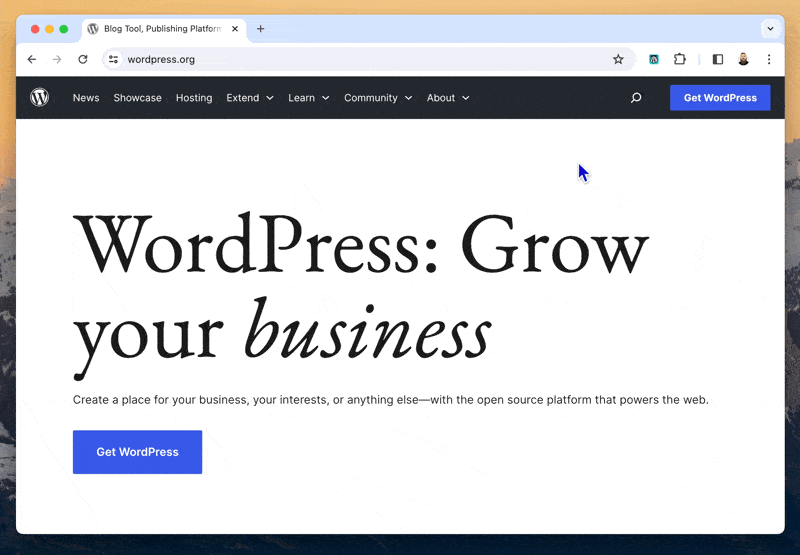

# WP API Walker - Chrome Extension

## Description

The WP API Walker extension is a browser extension designed to enhance the experience of navigating through WordPress sites. It offers a little popup palette that allows users to quickly search and access different types of content (e.g., pages, posts, custom post types) available on any WordPress site via its REST API.

## Features

- **Quick Access**: Easily access pages, posts, and custom post types of any public WordPress site.
- **Search Capability**: Offers a search function to quickly find the content you're looking for.
- **Easy Navigation**: Navigate through the available content types with ease.
- **Status Indicators**: Visually indicates whether content types are accessible or restricted.

## How to Use

1. **Install the Extension**: Download this repo and manually load it in developer mode.
2. **Navigate to a WordPress Site**: Open any WordPress site in your browser.
3. **Activate the Command Palette**: Click on the extension icon to activate the command palette.
4. **Browse Content Types**: Initially, the command palette will list all available content types (e.g., Pages, Posts) on the WordPress site.
5. **Select a Content Type**: Click on a content type to view all items under it. Accessible content types will be indicated with a green tick, while restricted ones will have a red cross.
6. **Search for Specific Content**: Use the search bar within the command palette to filter through the items listed under the selected content type.
7. **Access Content**: Click on any item to open it in a new browser tab.

## Installation

This extension is currently built using v2 of the Chrome Extension Manifest, and as such, is not yet available on the Chrome Web Store.

### Manual Installation (Developer Mode)

1. Clone or download the extension's repository to your local machine.
2. Open the Chrome Extensions page by navigating to `chrome://extensions/`.
3. Enable "Developer mode" at the top right.
4. Click on "Load unpacked" and select the directory where the extension is saved.
5. The WordPress Command Palette Extension should now be added to your browser and ready to use.

## Contributing

Contributions to the WP API Walker extension are welcome! Please feel free to submit pull requests or open issues to suggest improvements or report bugs.

## License

Dunno yet. ¯\\\_(ツ)\_/¯

---
